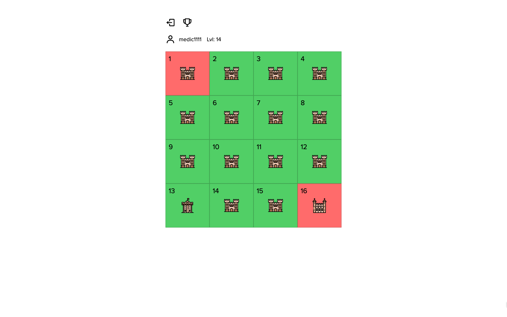

# Browser Clans



---

## The App:

Register to engage in the clan war MVP adventure. You will get a biggining army and attempt to conquer kingdoms are you begin a calculation approach to your attacks! Try your best to make it to the ranking board!

## The Story:

As a collaboration/contribution initiative, a team of 2 full stack, 2 frontend, 1 product owner got together to tackle a random project. The chosen project was a browser with the original world of warcraft (zero rights) as example, to be made in 1 week.

In spite of the difference in timezones and other difficulties along the way, the MVP is here.

### TECH

- Client: ReactJS, CSS, Styled Components
- Server: NodeJS, ExpressJS
- Database: MongoDB
- SCRUM: Github Projects

### Running it

- Fork this project and clone it
- Run `npm install` on the root
- Run `npm run dev` to start the server
- On a second terminal, run `cd client` and then `npm install` to install the client dependencies
- Then run `npm start` and go to localhost:3000

### ENV

```
TOKEN_SECRET=chooseYourStringWithoutQuotes
DB_URI=mongodb+srv://YOUR: CREDENTIALS!@YOURCLUSTER.xxkohq.mongodb.net/YOURDB

```

### TEAM

- PO
  - Harris
- Team Lead
  - Arua
- Frontend
  - Gene
  - Heitor
- Full Stack
  - Arua
  - Medic
- DB
  - Arua
  - Medic
- UI/UX
  - Arua
